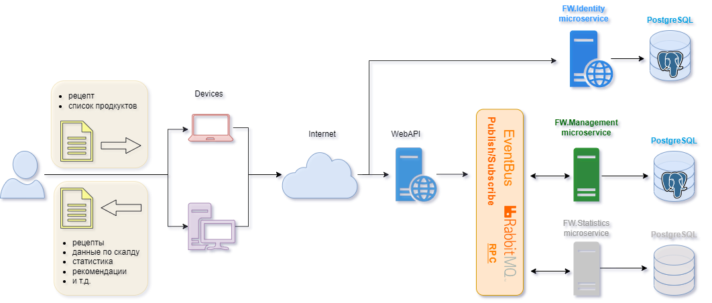
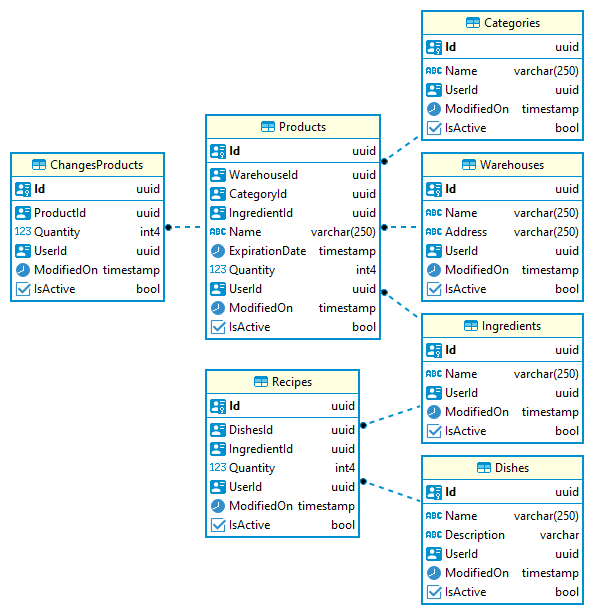

# Food_Warehouse_For_The_Cook
В выпускной работе применены полученные знания на курсе C# Developer. Professional:
- микросервисная архитектура;
- чистая архитектура;
- WebApi
- EntityFramework + PostgreSQL;
- RabbitMQ (Publish/Subscribe, RpсClients), MassTransit.RabbitMQ;
- шаблоны проектирования;
- многопоточность;
- асинхронность;
- IdentityServer4;
- Serilog;

# Food_Warehouse_For_The_Cook
Приложение представляет собой управление складом продуктов. 
На склад "Warehouse" добавляем продукты "Products". Создаем блюда "Dishes", "Recipes". При приготовлении блюда "Dishes" со склада автоматически списываются продукты "Products" по рецепту "Recipes" в соответствии со справочником "Ingredients". Изменения продуктов на складе фиксируются в "ChangesProducts".

## Application architecture

FW.Identity - микросервис регистрации/аутентификации/авторизации пользователей;       
FW.Managment - микросервис бизнес логики(добавления продуктов/рецеатов/блюд, автоматическое списание продуктов при приготовлении блюд);    
FW.Statistics - (не реализованный микросервис) микросервис статистики приготовленных блюд и затраченных продуктов;    

## Model DB

"Warehouse" - информация о складе продуктов.  
"Products" - информация о продуктах, которые хранятся на складе "Warehouse". Каждый продукт привязан к ингредиенту "Ingredients" и категории "Category".  
"Ingredients" - общий справочник продуктов (картошка, мука, молоко, и т.д.).  
"Category" - категории продуктов (овощи, крупы, молочные продукты и т.д. ).  
"Recipes" - состав продуктов из которого будет приготовлено блюдо "Dishes".  
"Dishes" - блюда, которые создает пользователь склада "Warehouse".  
"ChangesProducts" - информация об изменении количества продуктов в таблице "Products"  

## License
MIT License

## Project status
Project in development.
